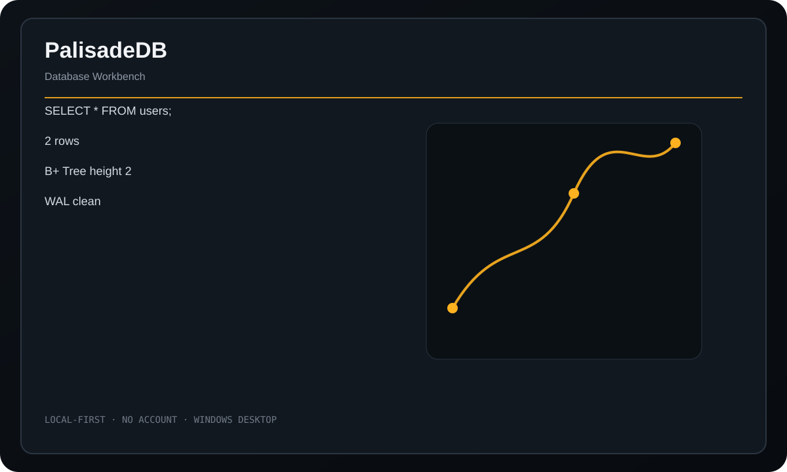

<div align="center">
  
  <h1>PalisadeDB</h1>
  <p><strong>A compact custom local database engine with its own pager, B+ tree, SQL layer, and recovery machinery.</strong></p>
  <p>
    <a href="https://github.com/purysho/PalisadeDB/actions/workflows/ci.yml"></a>
    <a href="https://github.com/purysho/PalisadeDB/releases"></a>
    <a href="LICENSE"></a>
  </p>
  <p><a href="https://github.com/purysho/PalisadeDB/releases"><strong>Download for Windows</strong></a> · <a href="#run-from-source">Run from source</a> · <a href="https://github.com/purysho/PalisadeDB/issues">Report an issue</a></p>
</div>



## What it does

- Custom .pdb database format
- Page-based storage layer
- B+ tree indexes
- SQL parsing and execution
- Transactions and WAL/recovery machinery
- Schema, page, tree, stats, and integrity inspection

## Download

Tagged releases are built on `windows-latest` by GitHub Actions. Each release contains `PalisadeDB.exe` and `PalisadeDB.exe.sha256`. The executable is produced from the source at that tag with PyInstaller.

> Until the first tagged release is published, the latest Windows build is available as the **PalisadeDB-windows** artifact on successful CI runs.

## Run from source

Requirements: Python 3.10+ with Tk support.

```powershell
pyw palisadedb_desktop.pyw
```

The application uses Python's standard library at runtime.

## Build a standalone Windows executable

```powershell
powershell -ExecutionPolicy Bypass -File .\build-windows.ps1
```

Output:

```text
dist\PalisadeDB.exe
```

## Privacy

PalisadeDB stores databases in local files and does not require a server, account, or network service.

## Scope

PalisadeDB is an educational but functional engine, not a production replacement for mature database systems. Its SQL grammar and durability model are intentionally compact and inspectable.

## Release process

- Every push runs tests/compile checks and builds a Windows executable artifact.
- Tags matching `v*` build the executable again, compute SHA256, and publish both files to GitHub Releases.
- See [CHANGELOG.md](CHANGELOG.md) for release history.

## License

MIT
